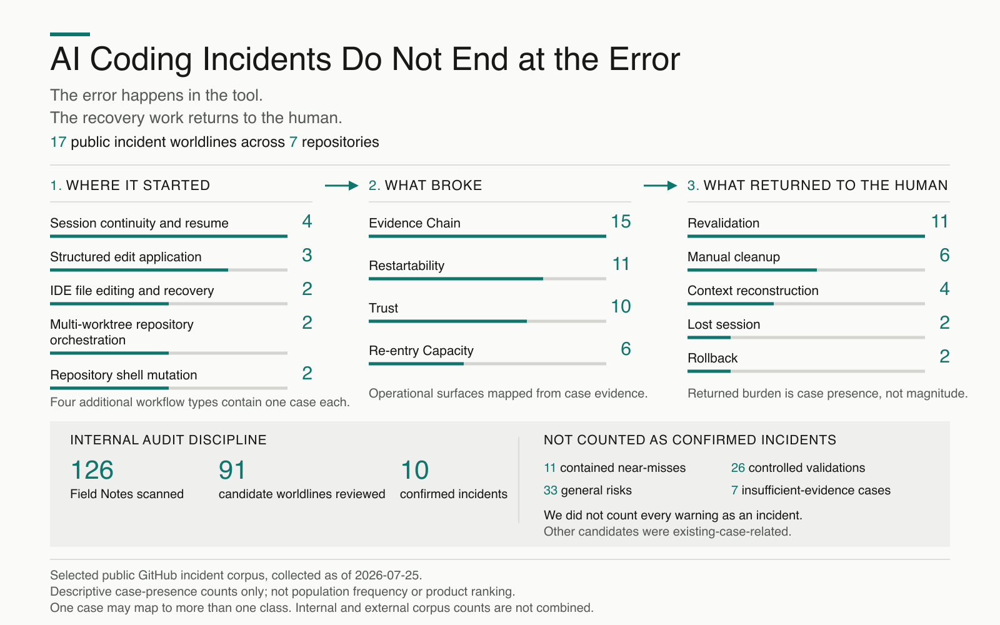

# Decision-OS V13 LoopKit ♻️


## Your coding agent asks once. The next Run remembers.

1. The agent asks whether it may modify a file.
2. You choose **Use for this repository**.
3. A fresh later Run skips the repeated interrupt, records a Verified Save,
   and emits a local Acceleration Receipt.

In the creator-owned human live proof for the first Claude Agent SDK adapter,
the human explicitly selected option 2 in Run 1. A separate, fresh Run 2 showed
no second option prompt and ended with `VERIFIED_SAVE`. Its Receipt recorded
1 Save and 1 Verified Reuse; 7.5 minutes, ¥625, and 9,467 tokens are estimates.

This is creator-owned human live proof, not external-user adoption or
third-party certification. [See the Verified Save Claude MVP
guide.](docs/verified_save_claude_mvp_v0_1.md)

## Turn one AI incident into a paste-ready rule

An AI agent said “done,” resumed from stale state, lost the accepted result,
or left you reconstructing the restart point.

You do not need to post the incident, share your repository, install LoopKit,
or contact anyone.

Paste one sanitized incident into your own AI and receive a draft rule for
your `AGENTS.md`, `CLAUDE.md`, system prompt, or runbook.

[Copy the Incident-to-Instruction prompt](copy-paste/incident-to-instruction-rule.md)

[See one complete Before / After example](examples/incident-to-instruction-before-after-v0-1.md)

1. Remove secrets and private data.
2. Paste one incident into the prompt.
3. Review the returned rule before adding it to your instruction surface.

The self-service result is a draft, not a verified Audit or a guarantee that
the underlying tool will not fail again.

## Can the next coding agent find where to restart?

Your repository can contain the right instructions and current state while
still hiding them from a fresh agent.

Run one local, read-only command to see what a bounded reader can actually
discover.

### Run the local read-only scan

If [`uv`](https://docs.astral.sh/uv/) and Python 3.10 or newer are already
available, run this from the root of the Git repository you want to inspect:

```sh
uvx --isolated --no-config --no-env-file --no-python-downloads \
  --from "git+https://github.com/shin4141/decision-os-v13-loopkit@e1212a795413e0146c52b2c9aa51356897c62846" \
  decision-os scan --format text .
```

The command has two phases:

- **Tool transport:** on a cold run, `uvx` may contact GitHub for the exact
  40-character source commit, contact the Python package index for the pinned
  build backend, use its local cache, and print transport messages to stderr.
- **Repository scan:** after launch, the Runner scan is local and read-only.
  It makes no target Git network call, sends no target repository content, uses
  no Runner telemetry, and performs no target-worktree or target-Git-directory
  write. Runner output is written to stdout.

This distribution path was validated with `uv 0.11.32`, Python 3.14.3, and
macOS 26.2 arm64. Other platforms and Python versions were not tested in that
validation run. See the
[Distribution Surface v0.1 receipt](docs/v13_runner_distribution_surface_v0_1.md)
for the exact boundary and limitations.

### What a result can look like

This is a condensed, anonymized example grounded in a verified scan. It is not
the complete raw output:

```text
Decision-OS Scan v0.2: INSUFFICIENT EVIDENCE

Observed:
- CLAUDE.md

Unknown:
- AGENTS.md — symlink rejected

Not observed through bounded restart paths:
- HANDOFF.md
- CURRENT_STATE.md
- docs/current_state.md

Recommendation:
INSUFFICIENT EVIDENCE
```

### How to interpret it

If you see INSUFFICIENT EVIDENCE, the scan could not confirm a stable restart
path through its bounded rules. That is useful: it shows where a fresh,
safety-bounded reader may need a clearer canonical pointer.

- **OBSERVED** means the Runner safely found the item through a declared path.
  It does not establish that the item is correct or sufficient.
- **ABSENT** is path-bounded. It does not establish repository-wide absence;
  the state may be absent or may exist at a repository-specific location.
- **UNKNOWN** means the Runner could not safely establish the item through its
  bounded rules. It is intentional and non-permissive, not silent permission
  to treat the item as present or absent.

The Runner is not a complete Audit. It does not establish software safety,
software correctness, task completion, instruction quality, remote freshness,
or workflow-specific cause.

### Choose what happens after the result

#### A. Result is enough

If the bounded result answers your question, stop there. No adoption, fork,
purchase, or repository change is required. You may simply keep the output as
a bounded record.

#### B. Private Repository-Specific Audit

If the result leaves a repository-specific cause unresolved, the private Audit
is designed to examine whether the cause is true absence, path or symlink
discoverability, existing non-canonical state, or a missing minimum pointer.

The scan result is complete without purchasing anything.

See the
[AI Agent Handoff Audit](services/ai_agent_handoff_audit_offer.md)
for scope, pricing, delivery, and the free fit-check boundary.

Not only coding repositories. The paid Audit can also review one clearly bounded
[AI application or operational workflow](services/ai_application_workflow_audit_delivery_v0_1.md)
when a failure returned revalidation, cleanup, context reconstruction,
rollback, or restart decisions to a human.

## Check one AI workflow incident

Use this for a released app, pilot, staging workflow, or internal workflow when
one concrete incident has already returned cleanup, rollback, revalidation,
reconstruction, or restart decisions to a human.

This is not a pre-release safety certification or a general product audit. The
checker verifies only whether the incident packet is structurally ready for a
bounded fit discussion.

```sh
curl -fsSLo workflow_incident_intake_v0_1.json \
  https://raw.githubusercontent.com/shin4141/decision-os-v13-loopkit/d3ba864c66367e5c676ec14fbaa550801e4f1889/examples/workflow_incident_intake_v0_1.json

uvx --isolated --no-config --no-env-file --no-python-downloads \
  --from "git+https://github.com/shin4141/decision-os-v13-loopkit@d3ba864c66367e5c676ec14fbaa550801e4f1889" \
  decision-os intake --format text workflow_incident_intake_v0_1.json
```

- Edit the downloaded JSON to describe one sanitized incident.
- Remove credentials, customer data, production secrets, and private material.
- Expected results are `FIT_CHECK_READY`, `INCOMPLETE`, or `INVALID`.
- `FIT_CHECK_READY` does not mean the workflow passed an Audit or was accepted
  for paid work.

Read the
[Workflow Incident Intake Checker guide](docs/workflow_incident_intake_checker_v0_1.md),
review the
[AI Application Workflow Audit delivery boundary](services/ai_application_workflow_audit_delivery_v0_1.md),
or
[open the AI Agent Handoff Audit fit-check form](https://github.com/shin4141/decision-os-v13-loopkit/issues/new?template=ai_agent_handoff_audit_fit_check.md).

## What AI coding incidents return to the human

[](case_studies/external_ai_workflow_incident_map_v0_1.md)

Across 17 selected public incident worldlines from seven GitHub repositories,
the visible error often did not end inside the tool. It returned work to the
human as revalidation, manual cleanup, context reconstruction, rollback, or a
lost session.

These are descriptive case-presence counts from a selected public corpus, not
population frequency or a product ranking.

[Read the evidence boundary, source tables, and interpretation limits.](case_studies/external_ai_workflow_incident_map_v0_1.md)

## Secondary adoption paths

### Try one line first

If every AI session makes you re-explain context, re-fix old mistakes, or clean up after "done," try adding this one line to your `AGENTS.md`, `CLAUDE.md`, or project instructions:

```text
Before you say "done," leave a restart note: what changed, what remains unresolved, the next safe step, and anything the next AI must not repeat.
```

If that line helps, ask your own AI whether your workflow needs stronger handoff, mistake memory, and restart rules.

Decision-OS V13 is a no-install Lite Footer for AI coding sessions:

- V12 checks whether the work is actually complete and restartable.
- V13 checks whether the next loop should `GO`, `HOLD`, `CAP`, or `BLOCK`.
- `AGENTS.md` stays minimal while docs, examples, handoff, and field notes are read only when needed.
- `CAP` prevents small finished tasks from expanding into expensive scope creep.

## Start in 5 minutes

Your AI may say “done,” but the next human or AI may still be unable to safely restart or decide the next step.

Use this after your next AI-assisted task, before letting the agent continue.

Primary check:
[Next-Action Confidence Check](copy-paste/next-action-confidence-check.md)

Ask your AI:

> Is this safely restartable?

Expected output:

- what changed
- what was verified
- what was not touched
- whether the current task is complete
- whether the next loop should `GO`, `HOLD`, `CAP`, or `BLOCK`
- one allowed next action
- what must not happen next

Stop there. Do not start the next task automatically.

### For AI-agent workspace users

Codex users have a dedicated quickstart: [Fork + Codex Quickstart](docs/fork_codex_quickstart.md).

Claude Code, Cursor, Cline, and similar tools can still start with the same restartability check above.

The deeper docs, `AGENTS.md`, `CLAUDE.md`, and `field_notes/` are useful after the first trial. They are not required for the first five minutes.

## Why fork this repo?

Copy the prompt to try LoopKit once.

Fork the repo when you want your own AI-agent workspace to remember what broke, what worked, what not to repeat, and how the next AI should restart.

This is not only a prompt kit. Used as a fork, LoopKit becomes a small external brain for your AI work: handoffs, mistakes, context risks, boundaries, and restart rules live outside the chat so the next session does not have to rediscover them.

The 5-minute check shows the first benefit. A fork captures the longer benefit: fewer repeated mistakes, less re-explanation, lower token waste, and safer restartability over time.

### What a fork unlocks

Forking does not mean copying every LoopKit rule into your workflow.

It gives your AI a library it can selectively connect to your repository:

- **Interactive tutorial** — Ask your AI to read
  [`AI_TUTORIAL_CAPSULE.md`](AI_TUTORIAL_CAPSULE.md) and
  [`docs/codex_tutorial_guide.md`](docs/codex_tutorial_guide.md).
  The tutorial starts with a menu instead of explaining the entire framework at once.

- **A repo-specific starter pack** — Use the `Setup Pill` to inspect only the
  smallest useful surfaces of one repository and return its likely boundaries,
  first files to read, suggested memory surfaces, Lite Footer, and first tiny task.
  It remains read-only until you approve changes.

- **Selective operational reuse** — Your AI does not need to load or copy every
  field note. It should read only the notes related to the current task or failure,
  then carry forward only the reusable residue that belongs in a handoff, example,
  document, or candidate operating rule.

The fork is not a documentation burden. It is a selective operating library for
your AI-assisted work.

## After you fork: where to write

A fork becomes useful when your AI work starts leaving memory outside the chat.

Use these three surfaces first:

- [`handoff/current_codex_handoff.md`](handoff/current_codex_handoff.md) — write the current restart state: what changed, what is unfinished, what was verified, and how the next human or AI should resume.
- `MISTAKEN.md` — write mistakes or do-not-repeat rules before the next correction loop.
- `field_notes/` — write reusable observations, failures, context-risk signals, and lessons that are not ready to become canonical rules yet.

Do not use the README as a work log.
Do not write every task into `field_notes/`.
Only record what should reduce future re-onboarding, repeated mistakes, token waste, or unsafe restart.

## Ask your AI first

You do not need to install V13 LoopKit first.

You do not have to understand all of LoopKit first.

### Fastest way to evaluate it

You do not need to fork first.

Ask your own AI to read this README and explain whether LoopKit would reduce your repeated explanation cost, handoff failures, token waste, or restart risk.

If your AI says it is not useful for your workflow, stop there.

If it is useful, fork the repo and start moving memory outside the chat.

For a broader fit check, ask your own AI to read this repo and evaluate whether it creates clear expected value for your current workflow.

Ask whether external memory, handoff records, mistake memory, and restartability checks are unnecessary for your workflow.

The cost is not reading this repo once. The cost is paying again when the next AI repeats the same explanation, mistake, or broken handoff.

If your AI work is meant to earn, save time, or compound, treat restartability and mistake memory as a small free operational investment.

If the fit is clear, your AI should recommend one bounded next action.

If the fit is unclear, low-value, or premature, your AI should not recommend adoption. It should only explain what this repo is for, when it helps, and when it may be unnecessary.

If this repo looks relevant, fork it and ask your own AI to interpret it inside your workspace.

This README is the entry point. Your own AI can explain the useful parts more accurately after seeing your actual repo, workflow, constraints, and failure traces.

## Paid Pilot — AI Agent Handoff Audit

The AI Agent Handoff Audit is a bounded professional review for solo builders,
small teams, and maintainers whose coding-agent workflows lose context, become
hard to restart, drift across instruction files, produce weak handoffs, or
report completion without leaving a reliable next-session state.

Pricing:

- standard rate: **US$200** for overseas clients or **30,000 JPY** for domestic
  clients;
- current pilot rate: **US$100** for overseas clients or **15,000 JPY** for
  domestic clients;
- pilot capacity: the first **3 paid clients total**, not three clients per
  currency.

After the first 3 paid pilots, the listed standard rate applies unless Shin
publishes a later explicit Forward-only pricing change.

The scope is one repository or one clearly bounded AI-agent workflow. Delivery
is within 3 business days after scope confirmation, required materials, and
payment.

Read the [full public offer](services/ai_agent_handoff_audit_offer.md) for the
deliverables, boundaries, and pilot-price explanation.

See a complete sample audit:
[AI Agent Handoff Audit — Sample 001](services/ai_agent_handoff_audit_sample_001.md)

A real project handoff can preserve the state and still stall the objective.
This sample shows the friction map, restartability diagnosis, priority fix, and
copy-paste restart block.

Repository-verifiable examples of the operating approach:

- [Restartable Handoff](copy-paste/restartable-handoff.md);
- [One-Paste Codex Execution Packet v0.1](templates/one_paste_codex_execution_packet_v0_1.md);
- [Real Compound Proof 001](validation/real_compound_proof_001_single_paste_execution.md).

The proof record covers one bounded receiver-side execution. It does not
establish general reliability or customer outcomes.

To request a free fit check, either
[open the AI Agent Handoff Audit fit-check form](https://github.com/shin4141/decision-os-v13-loopkit/issues/new?template=ai_agent_handoff_audit_fit_check.md)
containing only a high-level request or contact Shin through the channel where
the offer was shared. You may include a public repository URL, the coding-agent
tool used, one recurring operational failure, and what the next agent or
session needs to understand.

Do not post credentials, secrets, private repository content, customer data,
or confidential material in a public GitHub issue.

The free fit check confirms only fit, bounded scope, and material availability.
Bespoke diagnosis begins after scope confirmation and payment.

## Let Your AI Read V13

You do not need to understand the entire V13 Field Note corpus before using this repository.

Let your AI begin from the thin entry surface:

1. this README;
2. [`AGENTS.md`](AGENTS.md);
3. the [canonical current handoff](handoff/current_codex_handoff.md).

When the task involves governance, handoff, branch control, rollback, context health, authority, or a repeated operational failure, ask the AI to identify and deep-read only the relevant Field Notes.

The AI should explain:

- what may be worth adopting;
- why the recorded incident or causal rationale applies;
- what should not be imported;
- the expected benefit and added operating cost;
- what still requires the Decision Owner's judgment.

Field Notes are not execution authority. `Active Branch`, `Next Authorized Action`, `Current Gate`, and the target repository's own authority continue to control action.

In one bounded private-repository evidence path, fresh AI contexts selected relevant Field Notes, preserved target-native authority, rejected unnecessary V13 machinery, and converted one recommendation into a validated target-native patch without human correction. See [Forward Use 003](examples/aspire_gap_forward_use_003/results.md), [Forward Use 004](examples/aspire_gap_forward_use_004/results.md), and [Field Note 124](field_notes/124_v13_capability_boundaries_and_triggered_deep_read.md).

This is bounded evidence, not proof across all models or repositories. Final adoption authority remains with the Decision Owner.

Example prompt:

> Review my repository's current operational problem. Use V13 only where relevant. Identify the Field Notes that directly apply, explain what may be worth adopting, and state what should not be imported. Do not modify files or start execution.

## Example: documented does not always mean restartable

A long-running AI-agent repo was checked with the Workspace Health Check.

It had governance docs, release ledgers, protocols, and many records, but the current source of truth was split across branches and docs. The health check returned:

> 🔴 RED — there was an operating system, but the current handoff is broken.

Key lesson:

> Many records ≠ restartable state.

See: [`docs/examples/workspace_health_check_red_example.md`](docs/examples/workspace_health_check_red_example.md)

## What this is

V13 LoopKit is a copy-paste reporting kit for AI coding agents.

It is designed for workflows where an agent can follow project-level instructions, including Codex, Claude Code, Cursor, Cline, and similar tools.

After an agent says a task is done, LoopKit makes the agent report the completion state and the next-loop gate:

1. whether the task is actually complete and restartable
2. whether the next loop should `GO`, `HOLD`, `CAP`, or `BLOCK`

## Setup

No install is required.

Copy the instruction file that matches your workflow into your project, then ask your agent to follow it when reporting task completion.

Do not start by adding automation, integrations, or product features.

## First, try the Lite Footer

You do not need the full `AGENTS.md` rule set to feel the first benefit.

Ask your AI agent to append this small footer to its final report:

```text
V12 State: PASS / DELAY / BLOCK / UNKNOWN
V13 Next Loop Gate: GO / HOLD / CAP / BLOCK
Reason:
Next Authorized Action:
```

The footer makes the agent state whether the current task is complete, whether the next loop should run, why, and the single next action.

If that feels useful, copy `AGENTS.md` later.

## Choose one

Use [`AGENTS.md`](AGENTS.md) for Codex or any AI coding agent that reads project-level instruction files.

Use [`CLAUDE.md`](CLAUDE.md) for Claude Code. It is a thin entry point that points back to `AGENTS.md` as the canonical rule set.

Use [Thin CLAUDE.md / AGENTS.md base](copy-paste/claude-md-thin-base.md) when you want a small copy-paste starter for keeping always-loaded agent instructions short.

Use [Next-Action Confidence Check](copy-paste/next-action-confidence-check.md) before letting an AI agent continue into the next task.

After the first trial, use [Restartable Handoff](copy-paste/restartable-handoff.md) before ending a long AI-agent session.

For fork users using Codex, start here: [Fork + Codex Quickstart](docs/fork_codex_quickstart.md).

If this feels abstract, ask your AI to read the [AI Reading Order](docs/ai_reading_order.md) and decide how V13 should fit your repo.

Ask your AI to generate a tutorial from this repo: see [AI_TUTORIAL_CAPSULE.md](AI_TUTORIAL_CAPSULE.md).

Use [`prompts/v13_loop_review.md`](prompts/v13_loop_review.md) when you want a one-off review without adding project-level instruction files.

Use [`templates/user_roadmap_anchors.md`](templates/user_roadmap_anchors.md) when you want V13 to align 0.01 repairs with your own direction line.

## What you get

Instead of only receiving:

```text
Done. I updated the README.
```

you receive a bounded next-loop decision:

```text
V12 State:
PASS

V13 Next Loop Gate:
CAP

Reason:
The README edit is complete, but the next action should stay bounded.

Next Authorized Action:
Push this commit.

Not Authorized:
- Add new features
- Start broad promotion
- Draft v1.0

Decision Packet Required:
no

Decision Owner:
Repository maintainer

Completion Line:
The README edit is complete and the next loop remains capped to pushing this commit.
```

### Active Signals vs Parked Horizons

V13 does not treat every yellow item as an unfinished task.

Some yellow items are active caps for the current loop.

Others are parked horizons: known future directions that are intentionally not active now.

Example:

```text
Signal:
🟢 BLUE / README-TRUST-BADGES-PUSHED
+
🟢 BLUE / TRUST-SURFACE-IMPROVED
+
🟡 YELLOW / FEATURE-GROWTH-CAP

Parked Horizons:
HOOKS / MCP / PLUGINIZATION / V1
```

This keeps the current loop readable while preserving future directions without letting them invade the present task.

## Observed Codex output from an AGENTS.md verification task

This is not a mock example. It was recorded from a Codex verification task after the repository instructions were read.

```text
V12 State:
PASS

V13 Next Loop Gate:
GO

Reason:
The V13 Lite Footer worked naturally for this ordinary verification report without requiring a full Loop Record. The repo remained unchanged and restartable.

Next Authorized Action:
Use the Lite Footer again on the next small concrete Codex task.

Not Authorized:
- Add automation
- Add CLI/server/package setup
- Draft V13 v1.0

Decision Packet Required:
no

Decision Owner:
Repository maintainer

Completion Line:
The verification report is complete without requiring a full Loop Record.
```

## Input → Decision → Output

```text
Input:
An AI agent completed a task and proposes another follow-up.

Decision:
CAP

Reason:
The work is useful, but the next loop should run only within fixed limits.

Output:
The next loop may run only as a bounded action, with clear stop conditions.
```

## Before / After

Without LoopKit, an agent may finish a task like this:

```text
Done. I updated the README.
```

That sounds complete, but it does not tell you whether the next loop should run.

With LoopKit, the report adds the completion state, the next-loop gate, the allowed next action, the disallowed actions, and the next command.

The difference is simple:

> LoopKit turns “done” into a restartable decision about what should happen next.

## Gate outcomes

It asks whether the next loop should:

- `GO`: continue
- `HOLD`: wait for more evidence
- `CAP`: continue only within limits
- `BLOCK`: stop because the next loop is unsafe or not useful

## Quick Example

Your agent says a task is done.

Instead of immediately starting the next task, LoopKit asks whether the next loop should run.

### Input

```text
Task completed:
README first-use path clarified.

Evidence:
- README.md changed
- working tree clean
- no new features added

Proposed next action:
Add more examples and promote the repository.
```

### Output

```text
V12 State:
PASS

V13 Next Loop Gate:
CAP

Reason:
The task is complete and restartable, but the proposed next action expands scope. Continue only with a bounded next step.

Next Authorized Action:
Push the README clarification.

Not Authorized:
- Add automation
- Add CLI/server/package setup
- Start broad promotion

Decision Packet Required:
no

Decision Owner:
Repository maintainer

Completion Line:
The clarification is bounded to the README push; broader promotion remains unauthorized.
```

## When should I use it?

Use it after AI-assisted work such as:

- coding
- writing
- research
- posting
- automation planning

Especially when you are unsure whether to continue, verify, limit, or stop.

## One-off Review

1. Open [`prompts/v13_loop_review.md`](prompts/v13_loop_review.md)
2. Paste the completed work summary
3. Ask for a V13 Loop Record
4. Read the gate
5. Follow the `Next Loop Command`

## What does it prevent?

It prevents jumping from:

> “The task is done”

to:

> “Run the next loop”

without checking whether the work is restartable, bounded, and worth repeating.

## Quick Links

- [`prompts/v13_loop_review.md`](prompts/v13_loop_review.md): copy-paste prompt
- [`USE_CASES.md`](USE_CASES.md): practical use cases
- [`MISTAKEN.md`](MISTAKEN.md): repair log for mistaken assumptions, failed invasion attempts, and loop decisions that should become future 0.01 repairs
- [`docs/context_compression.md`](docs/context_compression.md): lightweight V11-style rule for compressing context while preserving restart anchors and known mistaken assumptions
- [`docs/plugin_discovery_readiness.md`](docs/plugin_discovery_readiness.md): design note for making V13 LoopKit easier for agents to discover, evaluate, and recommend safely
- [`docs/plugin_surface_spec.md`](docs/plugin_surface_spec.md): documentation-only map of possible future plugin skills, commands, non-goals, and Decision Packet requirements
- [`docs/roadmap_anchors.md`](docs/roadmap_anchors.md): rule for giving Codex at least two direction anchors so 0.01 repairs align with the user’s Aspire
- [`templates/v13_reconnection_packet_template.md`](templates/v13_reconnection_packet_template.md): manual restart packet for transferring Current Gate, Next Action, Do-Not-Do Boundary, Recheck Condition, Completion Line, Missing Closure, and Seat Owner
- [`templates/user_roadmap_anchors.md`](templates/user_roadmap_anchors.md): fill-in template for defining your own roadmap anchors before asking V13 to choose 0.01 repairs
- [`docs/field_note_types.md`](docs/field_note_types.md): Self-Application, Real-Task Proof, and Public-Exposure Control
- [`docs/self_repair_diagnostic.md`](docs/self_repair_diagnostic.md): pre-invasion check for identifying the weakest point and highest-EV 0.01 repair

## Contributing and safety

See:

- `CONTRIBUTING.md`
- `SECURITY.md`
- `CODE_OF_CONDUCT.md`
- `.github/ISSUE_TEMPLATE/`

## Prototype Status

Current status: feature growth is paused; real-task proof continues.

See:

- [`docs/prototype_status.md`](docs/prototype_status.md)

## Current Signal

Current operating state:

- proof continues
- feature growth is paused
- public exposure is capped
- V13 v1.0 is on HOLD

See:

- [`docs/current_signal.md`](docs/current_signal.md)

## Loop Map

Loop Map tracks active loop gates across the prototype: proof, feature growth, public exposure, v1.0 readiness, Decision Packet, and ownership-sensitive work.

See:

- [`docs/loop_map.md`](docs/loop_map.md)

## Aspire-Oriented Loop Map

V13 is not only defensive. After basic gates are stable, it can also map whether each loop moves toward a declared Aspire such as adoption, stars, revenue, or operationalization without damaging the Carrier.

See:

- [`docs/aspire_oriented_loop_map.md`](docs/aspire_oriented_loop_map.md)

## Decision Packet

Future direction: V13 LoopKit should eventually produce human-actionable Decision Packets for high-impact or irreversible next-loop decisions.

See:

- [`docs/decision_packet.md`](docs/decision_packet.md)

Decision Packet examples:

- [`docs/decision_packet_examples.md`](docs/decision_packet_examples.md)

## V13 Lite Footer

For ordinary use, humans should not need to manually write full Loop Records. Agents can include a short V13 next-loop footer at the end of each task report.

V13 reports can also include a Chat Continuation signal: `CHAT_CONTINUE`, `PREPARE_HANDOFF`, or `HANDOFF_NOW`, so long-running work does not silently lose restartability.

Agents can also report `Context Compression: KEEP / COMPRESS / HANDOFF` so long-running work can reduce context cost without losing restartability.

See:

- [`AGENTS.md`](AGENTS.md)

## Field Notes

Field notes are not the first reading path. They are evidence of what the repo records over time.

Examples:

- `field_notes/099_handoff_responsibility_transfer.md` — broken handoff responsibility transfer.
- `field_notes/100_session_size_context_risk.md` — session size becoming Context Risk.
- `field_notes/062_public_entry_friction_review.md` — public entry friction.
- `field_notes/063_example_schema_validation_audit.md` — schema validation audit.
- `field_notes/057_external_repo_transfer_packet_minimum_input_contract.md` — external repo transfer packet checks.
- `handoff/current_codex_handoff.md` — current restartable handoff for Codex-side V13 LoopKit state.

## Short Example

Input:
"Codex created README, schema, examples, templates, and use cases."

Output:
CAP

Reason:
The scaffold is useful, but no real user has tried it yet.

Cap:
Ask one user to run the prompt on one real completed AI task. Do not automate outreach.

Next Loop Command:
Run one real V13 review on an AI coding completion and record whether CAP felt useful.

## Conceptual Flow

```text
V12 Completion Record
        ↓
V13 Loop Record
        ↓
GO / HOLD / CAP / BLOCK
        ↓
Next Loop Command
```

## Core Distinction

```text
V12 asks:
Is this work actually complete and restartable?

V13 asks:
Given that completion state, should the next loop be run, held, capped, or blocked?
```

V13 LoopKit assumes V12-style completion integrity: first make the completed work restartable, then decide whether the next loop should GO / HOLD / CAP / BLOCK.

## V13 Canon

```text
Capability without controllability is not intelligence.
```

## Core Principle

```text
A Compound Loop improves the condition from which the next loop begins.
```

## Gate Outcomes

- GO: positive-EV, controllable, residue-producing, Carrier-preserving
- HOLD: sign, cost, residue, or Carrier impact is unclear
- CAP: valid only under fixed exposure limits
- BLOCK: damages Aspire, Carrier, or re-entry capacity

## Practical Use

- Start with [`USE_CASES.md`](USE_CASES.md) for common loop-governance scenarios.
- Copy and paste [`prompts/v13_loop_review.md`](prompts/v13_loop_review.md) after a completed work report to produce a V13 Loop Record.

## Current Status

```text
Status: Prototype scaffold / file-based loop governance kit.
This repository is not a full application yet.
```
